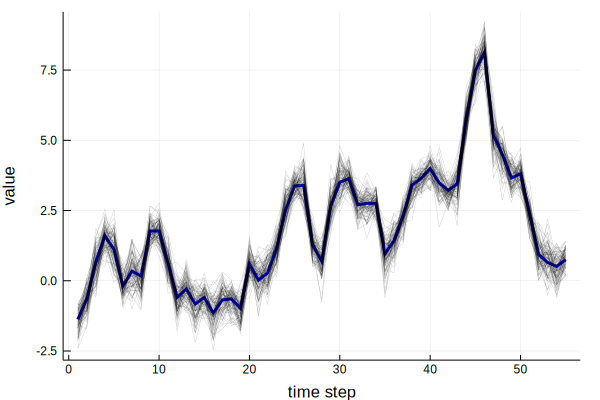

If dealing with several uncertain values, it may be useful to represent them
as an `UncertainDataset`. This way, one may trivially, for example, compute
statistics for a dataset consisting of samples with different types of
uncertainties.


## Example
Let's create a random walk and pretend it represents fluctuations in the mean
of an observed dataset. Assume that each data point is normally distributed,
and that the $i$-th observation has standard deviation $\sigma_i \in [0.3, 0.5]$.

Representing these data as an `UncertainDataset` is done as follows:

```julia
using UncertainData, Distributions, Plots

# Create a random walk of 55 steps
n = 55
rw = cumsum(rand(Normal(), n))

# Represent each value of the random walk as an uncertain value and
# collect them in an UncertainDataset
dist = Uniform(0.3, 0.5)
uncertainvals = [UncertainValue(Normal, rw[i], rand(dist)) for i = 1:n]
D = UncertainDataset(uncertainvals)
```


We may then resample the dataset by calling `resample(D)`. This will
[resample each uncertain value](../resampling/resampling_uncertain_values.md)
in the dataset. Alternatively, `resample(D, n)` resamples `n` times and returns
a `n`-element vector of resampled realizations.

Let's resample the uncertain dataset 100 times and plot the realisations.

```julia
using Plots

# Initialise plot
p = plot(legend = false, xlabel = "time step", ylabel = "value")

# Plot the mean of the dataset
plot!(mean.(D), label = "mean", lc = :blue, lw = 3)

# Resample the dataset 100 times, add a line to the plot at each iteration
for i = 1:100
    plot!(p, resample(D), lw = 0.4, lα = 0.2, lc = :black)
end
p
```




## Example 2: mixing different types of uncertain values
Mixing different types of uncertain values also works. Let's create a dataset
of uncertain values constructed in different ways.


```julia
using UncertainData, Distributions, Plots

# Theoretical distributions
o1 = UncertainValue(Normal, 0, 0.5)
o2 = UncertainValue(Normal, 2, 0.3)
o3 = UncertainValue(Uniform, 0, 4)

# Theoretical distributions fitted to data
o4 = UncertainValue(Uniform, rand(Uniform(), 100))
o5 = UncertainValue(Gamma, rand(Gamma(2, 3), 5000))

# Kernel density estimated distributions for some more complex data.
M1 = MixtureModel([Normal(-5, 0.5), Gamma(2, 5), Normal(12, 0.2)])
M2 = MixtureModel([Normal(-2, 0.1), Normal(1, 0.2)])
o6 = UncertainValue(rand(M1, 1000))
o7 = UncertainValue(rand(M2, 1000))

D = UncertainDataset([o1, o2, o3, o4, o5, o6, o7])
```

Now, plot the uncertain dataset.

```julia

using Plots
# Initialise the plot
p = plot(legend = false, xlabel = "time step", ylabel = "value")

# Plot the mean of the dataset
plot!([median(D[i]) for i = 1:length(D)], label = "mean", lc = :blue, lw = 3)

for i = 1:200
    plot!(p, resample(D), lw = 0.4, lα = 0.1, lc = :black)
end

p
```


